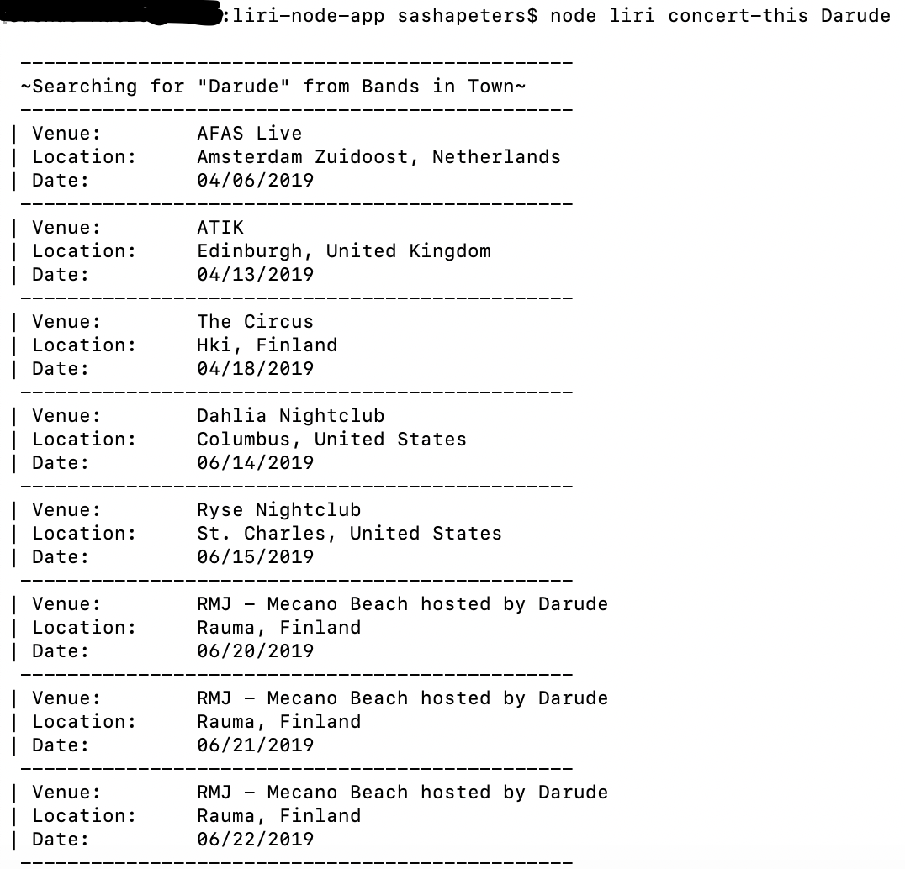
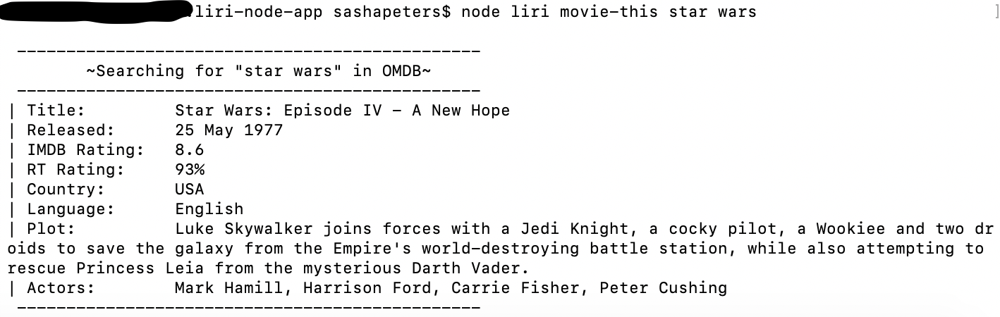
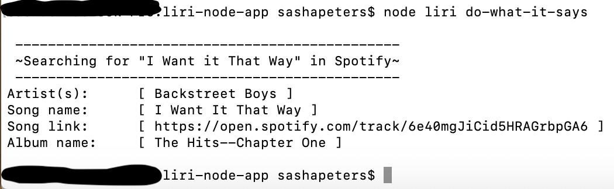

# liri-node-app
- Sasha Peters
- [Vanderbilt Coding BootCamp](https://bootcamps.vanderbilt.edu/)

- LIRI will search Spotify for songs, Bands in Town for concerts, and OMDB for movies`


## Instructions

`$ node liri 'search' 'term'`

### Search:
- `spotify-this-song 'song'`
- `concert-this 'artist/band'`
- `movie-this 'movie'`
- `do-what-it-says`

## Api information
- [Node-Spotify-API](https://www.npmjs.com/package/node-spotify-api)
- [OMDB API](http://www.omdbapi.com/)
- [Bands In Town API](http://www.artists.bandsintown.com/bandsintown-api)

## Additional Resources
- [Axios](https://www.npmjs.com/package/axios)
- [Moment](https://www.npmjs.com/package/moment)
- [DotEnv](https://www.npmjs.com/package/dotenv)

## .env information
### To use this create a .env in the root directory of liri-node-app
- In this file you will need:
```
# Spotify API keys

SPOTIFY_ID=your_spotify_id
SPOTIFY_SECRET=your_spotify_secret

# Concert-This API key

CONCERT_ID=your_bands_in_town_id

# OMDB API key

OMDB_ID=your_ombd_id
```

## Pictures
- ex: spotify-this-song

- ex: concert-this

- ex: movie-this

- ex: do-what-it-says

