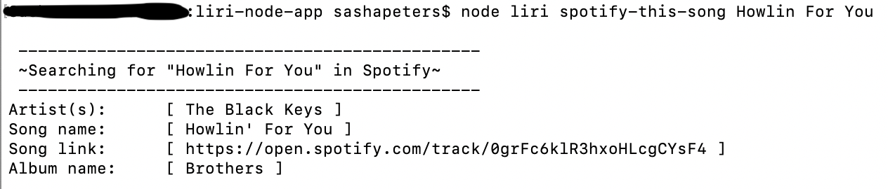

# liri-node-app
LIRI will search Spotify for songs, Bands in Town for concerts, and OMDB for movies


## Instructions

- $ node liri <search> <term>

### Search:
- spotify-this-song <song>
- concert-this <artist/band>
- movie-this <movie>
- do-what-it-says

## Api information
- node-spotify-api
- OMDB API
- Bands In Town API

## Additional Resources
- Axios
- Moment
- DotEnv

## .env information
### To use this create a .env in the root directory of liri-node-app
- In this file you will need:
```
# Spotify API keys

SPOTIFY_ID=your_spotify_id
SPOTIFY_SECRET=your_spotify_secret

# Concert-This API key

CONCERT_ID=your_bands_in_town_id

# OMDB API key

OMDB_ID=your_ombd_id
```

## Pictures
- ex: spotify-this-song

- ex: concert-this

- ex: movie-this

- ex: do-what-it-says

